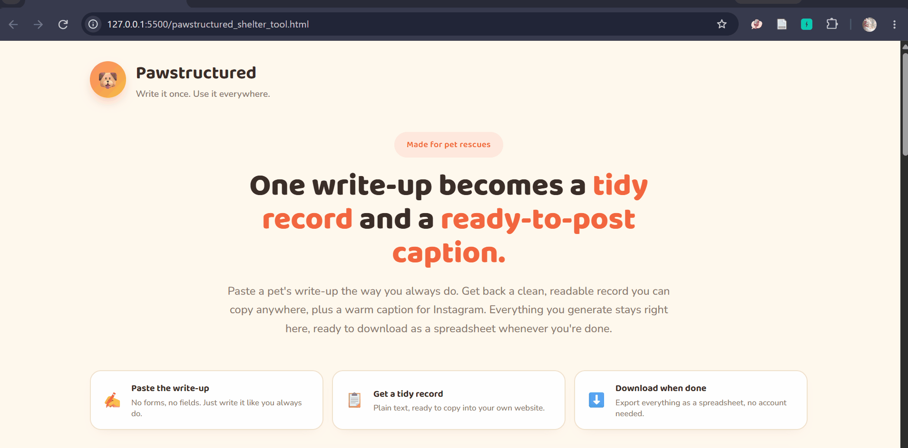

# 🐾 Pawstructured

**Write it once. Use it everywhere.**

A free tool for animal rescues that turns a volunteer's free-text pet write-up into a clean, structured intake record *and* a ready-to-post social media caption, all in one click.



## Try it
**[▶ Live demo](https://pawstructured.netlify.app/)** 

No login, no setup, no forms to fill out, just paste and go.

## The problem

Rescue volunteers already write warm, detailed descriptions of the animals in their care. But that same write-up usually has to be manually re-typed into an intake spreadsheet *and* rewritten again as a social caption, twice the work for every pet, every time.

Pawstructured skips the duplication: paste the write-up once, get both outputs back immediately.

## How it works

1. **Paste the write-up** - no forms, no required fields, just the way a volunteer would normally write it
2. **Get a tidy record** - AI extracts sex, age, weight, breed, hard requirements (e.g. "no kids," "needs a fenced yard"), and personality traits into a clean, copy-ready format
3. **Get a caption** - the same write-up is turned into a warm, first-person social caption with hashtags, ready to pair with a photo
4. **Download when done** - every pet processed in the session can be exported as a single CSV, no account needed

Everything lives in the browser for the duration of the session amd nothing is stored server-side.

## Tech stack

**Frontend** - single static HTML file, vanilla JS, no build step or framework
**Backend** - FastAPI (Python), calling the Google Gemini API for extraction and caption generation
**Deployment** -  backend on Railway; frontend deployable on Netlify

```
fastapi · uvicorn · pydantic · python-dotenv · requests
```
## Running it locally

**Backend**

```bash
git clone https://github.com/AISHA-YI/PawStructured.git
cd PawStructured
pip install -r requirements.txt --break-system-packages

echo 'GEMINI_API_KEY="add_your_key_here"' > .env

uvicorn arcade_backend_main:app --reload --port 8000
```

**Frontend**
Just open `pawstructured_shelter_tool.html` in a browser. If you're running the backend locally, update the "Connection settings" field in the UI to point at `http://localhost:8000` instead of the deployed Railway URL.

## Design notes

- **Zero data retention by design** - no database, no user accounts; each pet's data lives only in the browser tab until exported
- **Built-in usage cap** - the backend enforces a daily request limit so a shared API key can't run up unexpected costs
- **Resilient AI calls** - automatic retry with backoff on transient upstream errors (503s) before failing
- **Try-before-you-type** - a one-click example write-up lets a shelter volunteer see the tool work before committing their own data

## Built at Dogathon

Pawstructured started as a hackathon project at **Dogathon**, benefiting Copper's Dream Rescue.We placed Top 10
